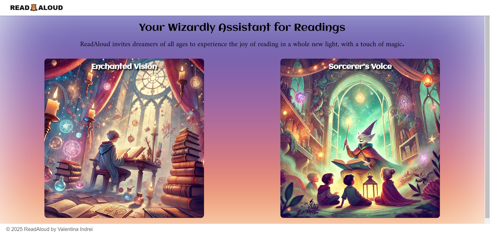
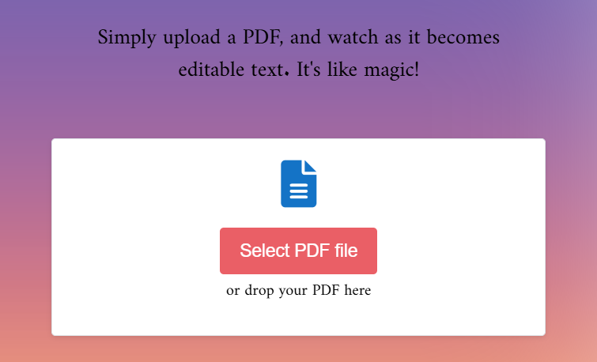
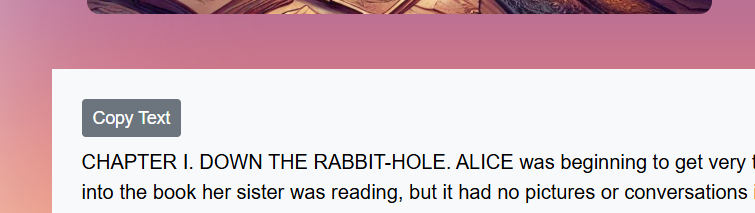
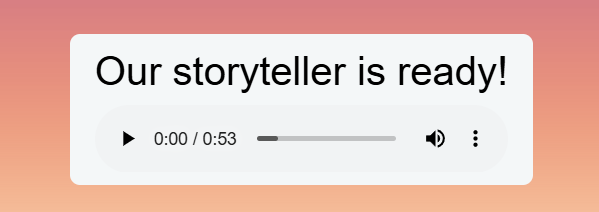

# ReadAloud

ReadAloud is a web application that transforms PDF documents into **editable text or spoken audio** using OCR and text-to-speech processing.

The application provides two main tools:

- **Enchanted Vision** - extracts editable text from scanned or image-based PDF documents using OCR.
- **Sorcerer's Voice** - converts uploaded PDF documents or directly entered text into speech.

## Interface Preview

### Home

<p align="center">
  
</p>

### OCR - PDF to Editable Text

<p align="center">
  
  &nbsp;&nbsp;
  
</p>

### Text-to-Speech

<p align="center">
  
  &nbsp;&nbsp;
  
</p>

## Features

### PDF to Text

- Drag-and-drop PDF upload
- PDF-to-image conversion
- OCR using Tesseract
- Extracted text displayed directly in the browser
- Copy extracted text to the clipboard

### Text or PDF to Speech

- Convert typed text to speech
- Extract text from PDF documents
- Generate audio using Google Cloud Text-to-Speech
- Integrated HTML5 audio player
- Download generated audio

## Tech Stack

**Backend**

- Python
- Flask
- Flask-SocketIO

**Document Processing**

- PyPDF2
- Tesseract OCR
- pdf2image
- Pillow

**Text-to-Speech**

- Google Cloud Text-to-Speech API

**Frontend**

- HTML
- CSS
- JavaScript
- Bootstrap
- Socket.IO

## Running Locally

### Requirements

The application requires:

- Python
- Tesseract OCR
- Poppler
- Google Cloud Text-to-Speech API key

Clone the repository:

```bash
git clone https://github.com/Schwarz28Iva/ReadAloud-Document-Helper.git
cd ReadAloud-Document-Helper
```

Install the Python dependencies:

```bash
pip install -r requirements.txt
```

Create a `.env` file based on `.env.example`:

```text
GOOGLE_TTS_API_KEY=your_api_key_here
```

If Tesseract is not available on your PATH, configure its executable path:

```text
TESSERACT_CMD=path_to_tesseract
```

Run the application:

```bash
python server.py
```

Then open the local address displayed by Flask in your browser.

## Project Motivation

ReadAloud was developed as an exploration of document accessibility and transformation, combining OCR and text-to-speech functionality in one interactive application.

The project involved integrating document processing, OCR, external APIs, WebSockets, backend services, and frontend interaction into an end-to-end web application.

## Notes

- Uploaded documents are intended to be processed by the application.
- Generated audio files are excluded from the repository.
- API keys and local environment settings belong in `.env`, which is ignored by Git.

## Possible Improvements

- Add automated tests for the processing services and API routes
- Add OCR language selection
- Add configurable text-to-speech voices and languages
- Improve accessibility and responsive behavior
- Add deployment configuration for a hosted demo